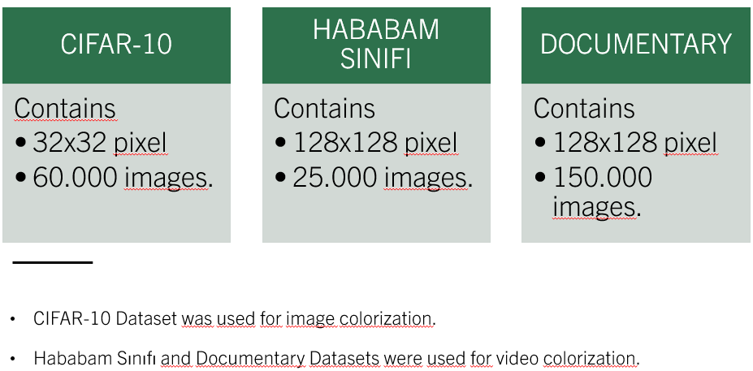

# Image_Video_Coloring_Generative_AI
## Scope of The Project 
Colorizing black-and-white photos and videos helps preserve historical and cultural heritage, making the past more accessible and enhancing aesthetic expression. 

In AI world, colorizing grayscale photos is a challenging problem, and this project's goal is to create a solution to coloring images and videos.

## Project Overview
Image colorization processes are very important to establish a connection between the past and the present. Many methods have been proposed for this task for many years. One of the most recent of these methods is the use of a Generative Adversarial Networks structure. Within the scope of the project, image and video colorization processes were performed with GAN models. During the project, firstly, the methods used were examined by reviewing the literature and preliminary studies were performed to understand the working principles of GAN architectures. Then, two different discriminators and two different generator structures were created to find the GAN model that gives the optimum performance. Four different GANs were created with these models. By changing the hyperparameters of the models, the performance of 8 different GAN models was measured with the CIFAR-10 dataset and grid search technique. According to the results, the model to be used was decided and based on these models. In the next step, 128x128 pixel ’Hababam Class’ and ’Documentary’ datasets were created for video colorization. Dependent GAN and independent GAN models were developed based on scene changes in the videos. Finally, an algorithm is developed to detect scene changes and a design is developed for the selection of GAN models. Model performances were measured by SSIM and PSNR scores. The results show that the colorization process with the GAN structure provides successful results. The potential of the adversarial structure of GAN models in reaching accurate results in the image colorization task is examined. In addition, a new design was developed for video colorization using two different GAN models according to scene change detection. In conclusion, this study examined the use of GAN models for image colorization tasks and demonstrated their potential for success. It is expected that with the development of models in the future, more detailed and accurate solutions can be developed.

## Datasets
The Cifar-10 dataset was used for 32x32 pixel image coloring which was imported as:
from tensorflow.keras.datasets import cifar10

The Hababam Sınıfı and Documentary datasets was generated by codes named `create_dataset_dependent.py` and `bitirme_dataset_creation.py`. First videos needs to be installed from youtube then this codes generated datasets with frame extraction method.

| Documentary Video | Length (min) | Link                                           |
|-------------------|--------------|------------------------------------------------|
| Tropical Island   | 66           | [video source](https://www.youtube.com/watch?v=RvZFYE5jo1M)  |
|                   | 60           | [video source](https://www.youtube.com/watch?v=QHoG2ZcWA_I)  |
|                   | 32           | [video source](https://www.youtube.com/watch?v=Y9NX0gxIkso)  |
|                   | 48           | [video source](https://www.youtube.com/watch?v=-P-wROJHXNA) |
|                   | 78           | [video source](https://www.youtube.com/watch?v=Lg5tDnxI9a0)  |
|                   | 61           | [video source](https://www.youtube.com/watch?v=onOEns_MnC4)  |
|                   | 47           | [video source](https://www.youtube.com/watch?v=SYIEFsP8Hy0)  |
| Switzerland Village | 34         | [video source](https://www.youtube.com/watch?v=vptRpH-EZzo)  |
|                      | 60         | [video source](https://www.youtube.com/watch?v=XWCjWDnwsv0)  |
|                      | 32         | [video source](https://www.youtube.com/watch?v=tIPrF6QnwGk)  |
|                      | 61         | [video source](https://www.youtube.com/watch?v=E-lUppr5s80)  |
|                      | 21         | [video source](https://www.youtube.com/watch?v=kXzheoOk-M0)  |
|                      | 31         | [video source](https://www.youtube.com/watch?v=q4Fl5iCGD5I)  |
|                      | 14         | [video source](https://www.youtube.com/watch?v=g1tF1v1MSAM)  |
|                      | 46         | [video source](https://www.youtube.com/watch?v=8mSG40o-iJ0&t=1577s) |
|                      | 27         | [video source](https://www.youtube.com/watch?v=XWMYn71MEZ4)  |
|                      | 11         | [video source](https://www.youtube.com/watch?v=ImTqvWxc2Fo)  |
|                      | 34         | [video source](https://www.youtube.com/watch?v=qLlh-aAqwNw)  |
|                      | 23         | [video source](https://www.youtube.com/watch?v=ZpFn9CoABLY)  |
|                      | 53         | [video source](https://www.youtube.com/watch?v=Bq4rmeIvJbs)  |
| Hababam Sınıfı Movie | 85        | [video source](https://www.youtube.com/watch?v=hf2-8MRPGu8&list=PLh4w83c2KrcGAfaBRR_APWzT6r0j4IXVq&index=1&pp=iAQB) |
|                        | 92        | [video source](https://www.youtube.com/watch?v=6M2N1dztNU0&list=PLh4w83c2KrcGAfaBRR_APWzT6r0j4IXVq&index=2&pp=iAQB) |
|                        | 95        | [video source](https://www.youtube.com/watch?v=4rAnNKCxlnc&list=PLh4w83c2KrcGAfaBRR_APWzT6r0j4IXVq&index=3&pp=iAQB) |
|                        | 87        | [video source](https://www.youtube.com/watch?v=QzUIVhJu0jQ&list=PLh4w83c2KrcGAfaBRR_APWzT6r0j4IXVq&index=4&pp=iAQB) |
#### Hababam Sınıfı Dataset:

left: gray image - middle: ground truth - right: generated
#### Documentary Dataset:

left: gray image - middle: ground truth - right: generated

#### Specs:

Generated 'Hababam Sınıfı' and Documentary datasets also can be download from this [drive link](https://drive.google.com/file/d/1sDLAGshW12v1SpvYLyGNlHryGSNXJD54/view?usp=sharing)

## Models For Low Resolution Grid Search Training
#### Discriminator 1:

 
#### Discriminator 2:

 
#### Generator 1:

#### Generator 2:

 

#### Grid Search Diagram:

#### Results:

This models were trained with Cifar-10 and their success was compared. The discriminator-2 and generator-2 combination had better results than other combinations. Accordingly at video colorization this models were taken as base.

## Video Colorization

The grid search results we made are examined and it is seen that discriminator 2 and generator 2 are more successful.

These two models are optimized and modified to run at higher resolutions. When the model colors each frame while creating a video, the same object can be colored differently in consecutive frames. To prevent this, it is checked whether there is a scene change, and if there is no change, information is transferred from the previous colored frame to the current re-coloring process. We will call our previous frame-dependent coloring model as ’Dependent’, and our independent model as ’Independent’. The adaptation of this in the video creation structure is examined below:

#### Results:

- [Hababam Sınıfı - Colorized Video](https://drive.google.com/file/d/1oSKEDODvLJEQZi1mq5UbHO3LSSNfvaXF/view?usp=) 

- [Island - Colorized Video](https://drive.google.com/file/d/1W\_h0QmoZuGdbQSq9S\_stEcw9p-ggDgaA/view?usp=sharing) 

- [Village - Colorized Video](https://drive.google.com/file/d/14HQfcIGf\_brzKGtOWZg9sYzcC1w99L5s/view?usp=sharing) 

## Documentation
- [Paper](Doc/Rapor_20011023_19011038.pdf)
- [Turnitin Report of Paper](Doc/Turnitin_20011023_19011038.pdf)
- [Poster](Doc/Poster_20011023_19011038.pptx)
- [Presentation](Doc/TheSunum.pptx)

## Collaboration
Collaborated with [Alperen Ölçer](https://github.com/Alperenlcr)

